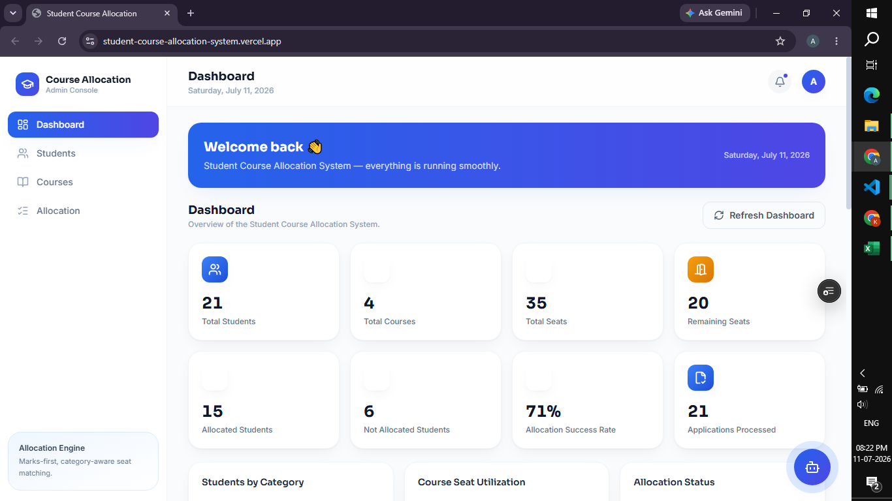
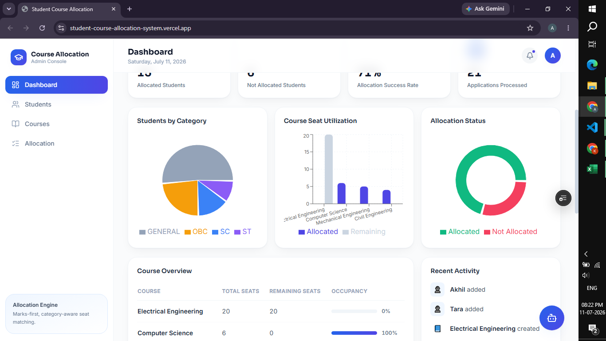
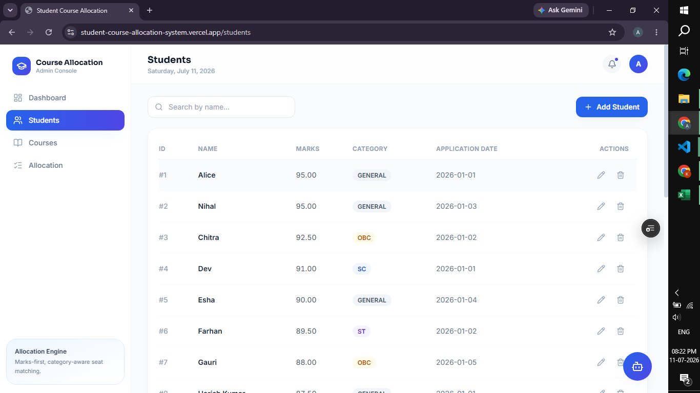
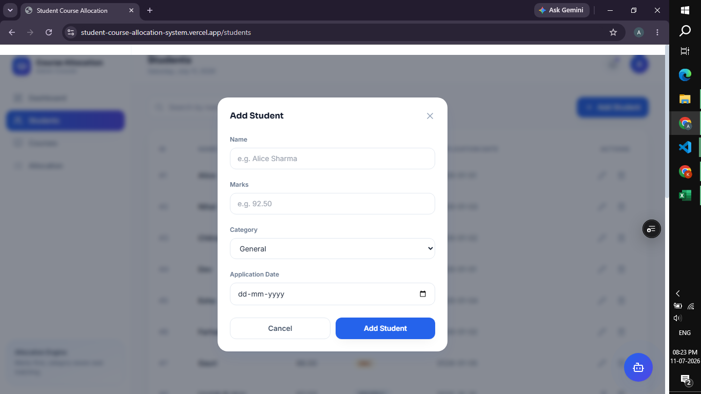
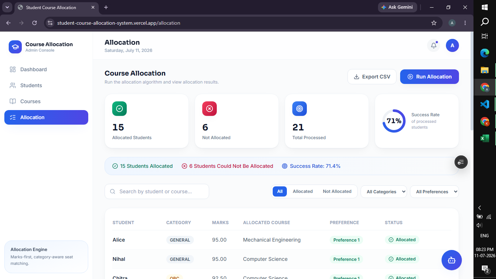
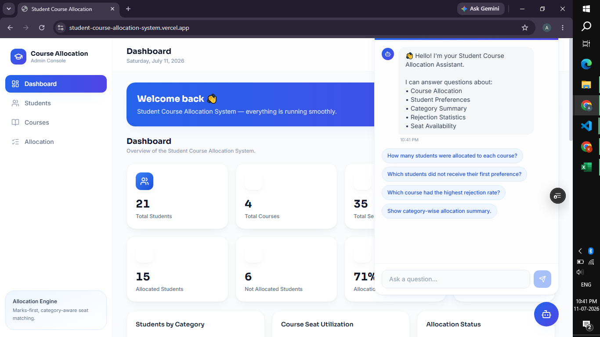
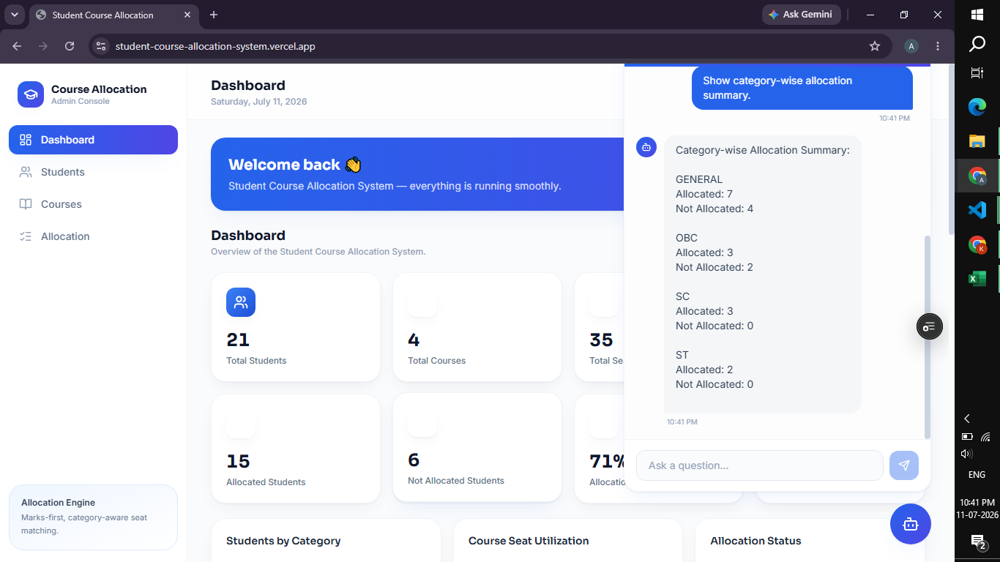
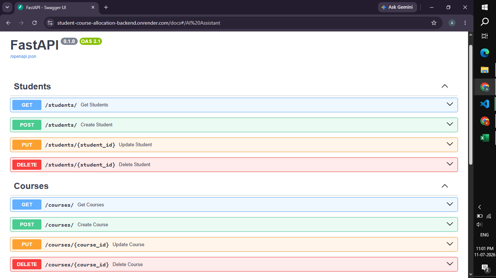
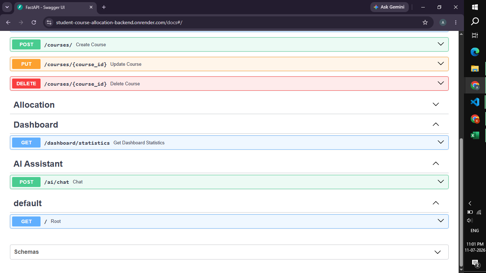

# 🎓 Student Course Allocation System

A full-stack web application that automates student course allocation based on **academic merit, reservation category, and course preferences**. The system includes a modern admin dashboard, intelligent seat allocation engine, and an AI Assistant capable of answering allocation-related queries.

---

## ✨ Features

### 👨‍🎓 Student Management
- Create, update, delete, and search students
- Manage student marks, category, and application details
- Pagination and search functionality

### 📚 Course Management
- Create, update, and delete courses
- Configure category-wise seat distribution
- Track remaining seats in real time

### 🎯 Intelligent Course Allocation
- Merit-based allocation algorithm
- Supports reservation categories (GENERAL, OBC, SC, ST)
- Allocates students according to course preferences
- Automatically updates seat availability
- Prevents over-allocation

### 📊 Dashboard & Analytics
- Student and course statistics
- Allocation success rate
- Seat utilization overview
- Category-wise distribution
- Interactive charts and visualizations

### 🤖 AI Assistant
Provides instant answers to questions such as:

- How many students were allocated to each course?
- Which students did not receive their first preference?
- Which course had the highest rejection rate?
- Show category-wise allocation summary.

---

# 🛠️ Tech Stack

| Category | Technologies |
|----------|--------------|
| Frontend | React (Vite), Tailwind CSS, Axios |
| Backend | FastAPI, SQLAlchemy, Pydantic |
| Database | PostgreSQL |
| Tools | Git, GitHub, Postman, VS Code |

---

# 📁 Project Structure

```
student-course-allocation-system
│
├── backend
│   ├── app
│   │   ├── models
│   │   ├── routers
│   │   ├── schemas
│   │   ├── services
│   │   └── main.py
│   ├── requirements.txt
│   └── create_tables.py
│
├── frontend
│   ├── src
│   │   ├── components
│   │   ├── pages
│   │   ├── services
│   │   └── hooks
│   └── package.json
│
└── README.md
```

---

# 🚀 Getting Started

## Clone the repository

```bash
git clone https://github.com/anupamatp/student-course-allocation-system.git
```

---

## Backend Setup

```bash
cd backend
python -m venv venv
```

### Windows

```bash
venv\Scripts\activate
```

Install dependencies

```bash
pip install -r requirements.txt
```

Configure PostgreSQL credentials in your configuration file.

Create database tables

```bash
python create_tables.py
```

Run the backend

```bash
uvicorn app.main:app --reload
```

API Documentation

```
http://127.0.0.1:8000/docs
```

---

## Frontend Setup

```bash
cd frontend
npm install
npm run dev
```

Frontend

```
http://localhost:5173
```

---

# 🤖 AI Assistant

The built-in AI Assistant supports:

- Course allocation insights
- Preference analysis
- Rejection statistics
- Category-wise allocation summary

# 🔮 Future Improvements

- User Authentication
- Role-Based Access Control
- PDF Report Generation
- Email Notifications
- Docker Deployment
- Cloud Deployment

---
## 📸 Screenshots

### Dashboard




### Students




### Courses


### Allocation


### AI Assistant



### API Documentation (Swagger)



---

# 👩‍💻 Author

**Anupama T P**

- GitHub: https://github.com/anupamatp